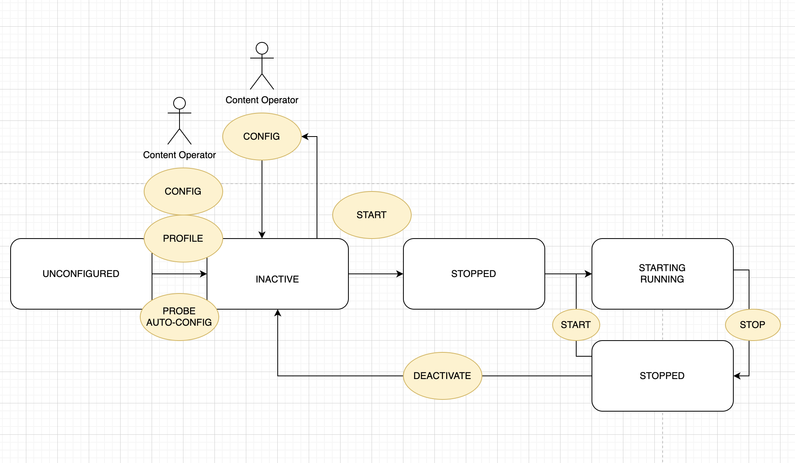

### STREAM OPERATION

Create Live Stream content object
- state `unconfigured`

Configuration options:

- manual (or copy from 'profile')
- probe stream - automatic configuration
- probe stream + manual verification/adjustments

After configuration - state `inactive`

Start stream - state `starting` then `running`
- may apply some configuration

Stop stream - state `stopped`
 - may apply some configuration

Deactivate stream - state `inactive`
 - may apply new configuration (basically making a new stream using the same object)

### STATUS

States:
- `unconfigured`
- `inactive`
- `starting`
- `running`
  - degraded + reasons
  - degraded severely + reasons
- `stalled`
- `stopped`

Input

- timestamp discontinuity - number of occurrences and total missed
  - `degraded` - `timestamp discontinuity`
- input time vs clock
  - if >1 sec `degraded' - `slow input`

Audio sync

- start timestamp offset for each audio stream
- if > 1 frame `degraded` - `audio offset`

Recording latency

- if >2sec `degraded` - `delay`
- if >5sec `degraded` - `large delay`

Recording progress
- if no video and no audio for 10 sec `stalled`

Recording tech
- conforming fragments and frames
- conforming timestamps
- frame pipeline buffer (read - written)

### CONFIGURATION

State `running`

- watermark - enable/disable, set new parameters
- copy as vod

State `stopped`

In addition to `running`:
- streams selection (add/remove audio streams)
- playout parameters (ABR ladder, watermark)
- audio offset
- tech

State `inactive`

In addition to `stopped`

- stream URL (rtmp/udp/srt)
- recording parameters - resolution, bitrate, codec