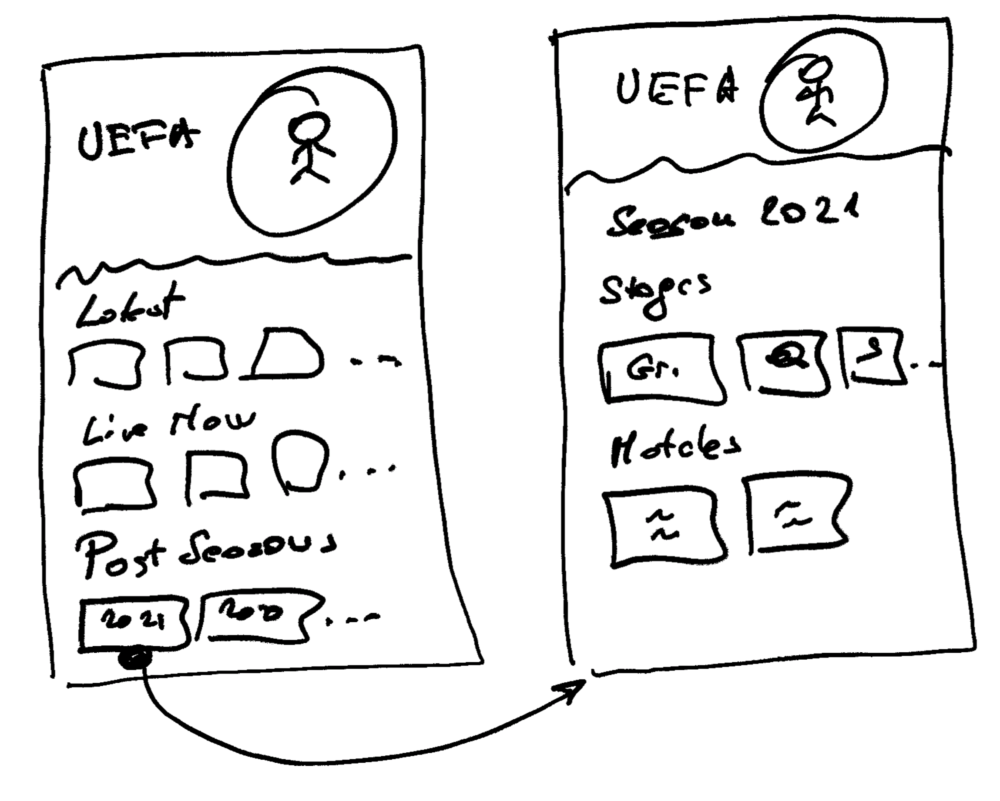

# MEDIA WALLET - COLLECTIONS AND CAROUSELS

## PROBLEMS TO SOLVE

Create specific views for properties like sports leagues, tournaments, live performance events (which may be multi-day 'festivals') as well as live and on-demand media apps (netflix, fox sports, ...).
  - these apps require 'season' views, 'stage' views, 'TV series', ...

Each view needs UI elements (hero, trailers, ...) and 'carousels' which are either fixed or dependent on the view (for example "Live Now" carousel will be secific to the tournament stage).

## MAIN CONCEPTS

Properties may define:
  - collections
  - carousels

Content objects
  - content objects storing primary assets (the movie, the match, promos)
  - content objects storing associated assets - trailers, clips, extras (associated to a primary asset)

Media Catalog
 - points to conetent objects storing primary assets

Collections are needed when we need a 'page' for a grouping (like a TV series, sporting event stage)
  - and so we can structure things in special views (like google NBA, NFL)

Collections may be
  - manual lists - specify each collection and its metadata & assets
  - automatic (by filter) -- though I think this is impractical because we need assets for each
    (we may use a generic asset for all collections - eg. all seasons of a series, all 'days' of a tournament)

Collections are not hierarchical (even if conceptually they might be)
  - if we need somehting like breadcrumbs in the UX we can make a 'parent' field and link them

Carousels are displayed on various pages (property, collection, asset)

  - contain items: collections & primary assets (content object)
  - can be automatic or manual (currated list)
  - an automatic carousel may need to match the page it is on

Property 'fields'
  - defined in the property object to create filtered views and collections

## PROPERTY

  fields
    - event_type      type: enum   values: ["euro championship", ...]    // much like content type definitions
    - event_season    ("2023", "2023/2024", ...)
    - event_stage     (preseason, groups, playoffs, playin, roundof16, quarterfials, semifinals, ...)
    - event_day       (event_week for NFL)

  collections

    - event_type      // can be also called 'tournament'

      - type: list    // items are listed manually
      - items:
        - "six_nations"
          - title: "Six Nations"
          - thumbnail:
          - poster:
          - hero:
        - "heineken_cup"
          - ...
        - "hsbc_rugby_sevens"
          - ...

    - event_season
       - type: list  // items are listed manually
       - items:
         - "six_nations_2021"
           - ...
         - "six_nations_2022"
           - ...

    - event_stage
      - type: auto
      - match_params:  // for auto collections specify filter
        - event_type
        - event_season
        - event_stage
      - items   // here to put special assets (optional)
          semifinals:
            hero: link-to-image
            synopsis: some-paragraphs

    - event_day
      - type: auto
      - match_params:
        - event_type
        - event_season
        - event_stage
        - event_day

  carousels

    tournaments:
      - for_property
      - match_params:
        - collection: "event_type"       // carousel items will be 'collections'
        - event_type
        - title_type: tournament_intro   // also have videos about tournaments (one or more)

    current_season:
      - for_collections: [event_type]

    current_stage
      - for_collections: [event_season]
      - type: auto
      - match_params: // for auto
        - event_type
        - event_season
        - event_stage : 2024

    live_now
      - for_property
      - for_collections: [event_season, event_stage, event_day]
      - for_titles: [live_stream, live_stream_vod]
      - match_params
        - event_season
        - event_stage
        - event_day
      - filter
        - live start time / live end time

    upcoming
      - for_property
      - for_collections: [event_season, event_stage, event_day]
      - for_titles: [live_stream, live_stream_vod]
      // same as live_now but different live start/end time condition

    seasons
      - for_property
      - for_collections: event_type

    stages
      - for_collections: [event_season]

### CONTENT OBJECTS

Under `/public/asset_metadata`:

  asset_type:  primary | attachment | trailer | clip
  title_type
    - live_match
    - match
    - episode
    - movie
    - movie bundle (?)
    - also more specific: "pregame", "sports_talk", ...

  event_type
  event_season
  event_stage
  event_day

  associated_assets  // may just have one list and use `asset_type` of the objects we point to for queries

## API

### Make property page

#### GET /carousels?for_property

Returns all carousels for the property page

{
    "carousels" : {

        "tournaments" : {
            "items" : {
                "2023_year_in_review" : {
                    type: sports_talk,
                    title: "2023 Year in Review",
                    thumbnail: ...
                }
                "six_nations" : {
                    type: collection,
                    title: "Six Nations",
                    thumbnail: ...,
                    poster: ...
                },
                "heineken_cup: {
                    ...
                }
            }
        },

        "live_now" : {
            "items" : {
                ...
            }
        }
        "upcoming" : {
            "items" : {
                ...
            }
        }
    }
}

### Make an event stage page

User clicks on tournament "Six Nations" then has a "Current Seasons" carousel
- then user clicks on "Quarterfinals" item in the carousel which is a collection of type 'event_stage'

#### GET /collections/event_stage ? event_type=six_nationsp & event_instance=2024 & event_stage=quarterfinals

Returns the info for this collection:

{
    "title" : "Six Nations 2024 Quarterfinals"
    "images" : {
        "hero" : "/qfab/link to file",
        "title_treatment" : ""
    },
    "carousels" : {
        ... // all the carousels that match "for_collection 'event_stage' with filter `event_type=six_nationsp & event_instance=2024 & event_stage=quarterfinals`
    }

}

### Make a match page under the above stage page (quarterfinals)

#### GET /content/id ? event_type=six_nationsp & event_instance=2024 & event_stage=quarterfinals

Returns the content info and corresponding carousels:

{
    "title" : "Six Nations 2024 Quarterfinals"
    "images" : {
        "hero" : "/qfab/link to file",
        "title_treatment" : ""
    },
    "playout": ... (link to options.json or resolve options.json inside here)
    "carousels" : {
        ... // all the carousels that match "for_titles 'live_match' with filter `event_type=six_nationsp & event_instance=2024 & event_stage=quarterfinals`
    }

}

## EXAMPLE USE CASES

### PROPERTY - RUGBY

    CAROUSEL - TOURNAMENTS
    - Six Nations
    - Heineken Cup
    - HSBC Rugby Sevens
    - Womens Sevens

    CAROUSEL - LIVE NOW
    - across all tournaments

    CAROUSEL - HIGHLIGHTS
    - across all tournaments - sorted by most recent

    RECENT (REPLAYS)
    - across all tournaments

    ENTERTAINMENT - CAROUSEL
    - movies and series

TOURNAMENT PAGE (eg. Six Nations)

  Collection: event_type: "six nations"

  CAROUSEL - LIVE NOW
  - for this tournament, this season (2024)

  CAROUSEL - ARCHIVE
  - list of seasons, newest first (2023, 2022, ...)

SERIES PAGE (eg. Scurm)   // Entertainment content - movies, series, misc videos

  CAROUSEL - Current Season
  - list of episodes, newest first
  CAROUSEL - Seasons
  - list of seasons

